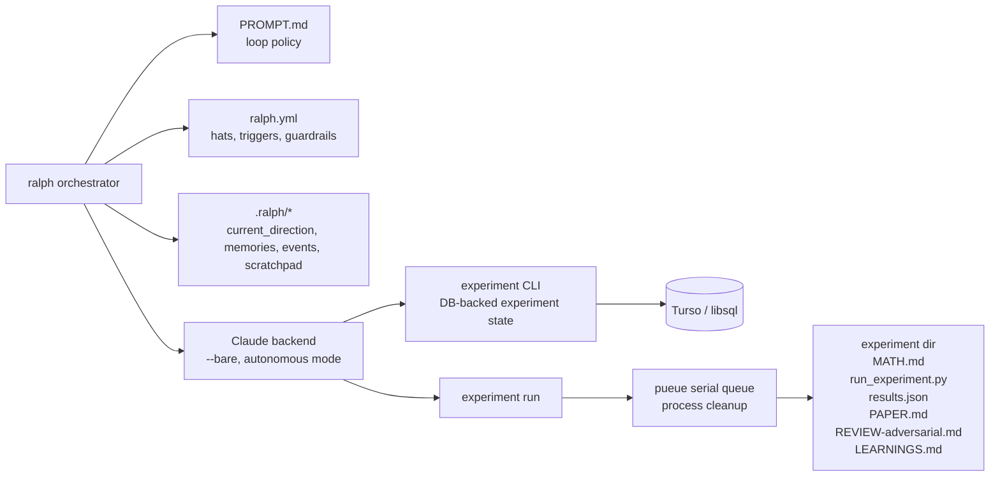

# Ralph experiment workflow

Current repo setup as implemented in `ralph.yml`, `PROMPT.md`, `AGENTS.md`, `.agents/workflows/research-loop.md`, and `.ralph/*`.

I also checked the official Ralph docs at `https://mikeyobrien.github.io/ralph-orchestrator/`, especially:
- `concepts/hats-and-events/`
- `guide/configuration/`
- `guide/cli-reference/`
- `advanced/architecture/`
- `advanced/parallel-loops/`
- `migration/v2-hatless-ralph/`

## End-to-end loop

```mermaid
flowchart TD
    A[ralph run -a -v\nstarting_event: research.start\nprompt_file: PROMPT.md] --> B[Researcher hat\ntrigger: research.start | learning.complete | review.revise]

    B --> B1[Read context\n.ralph/current_direction.md\n.ralph/memories.md\nCODING_GUIDELINES.md]
    B1 --> B2[Claim work\nexperiment claim researcher]
    B2 --> C{run_experiment.py exists?}

    C -- No --> D[Design phase\nwrite MATH.md\ninvoke fast-mlx + mlx-dev before MLX code\nwrite run_experiment.py\nupdate .ralph/current_direction.md]
    C -- Yes --> E[Execution phase]
    D --> E

    E --> E1[Queue + run via experiment run <id>\nbacked by pueue process isolation]
    E1 --> E2[Read results.json]
    E2 --> E3[Write PAPER.md\nprediction vs measurement table]
    E3 --> E4[Complete DB state\nexperiment complete <id> ...]
    E4 --> F[Emit experiment.done]

    F --> G[Reviewer hat\ntrigger: experiment.done]
    G --> G1[Read current experiment from .ralph/current_direction.md\ninspect MATH.md + PAPER.md + results.json]
    G1 --> G2[Write REVIEW-adversarial.md]
    G2 --> H{Verdict}

    H -- REVISE --> I[Emit review.revise\nmax 3 blocking fixes]
    I --> B

    H -- KILL --> J[experiment complete --status killed\nexperiment finding-add ...\nemit review.killed]
    H -- PROCEED --> K[experiment finding-add ...\nemit review.proceed]

    J --> L[Analyst hat\ntrigger: review.killed | review.proceed]
    K --> L
    L --> L1[Read PAPER.md + REVIEW-adversarial.md]
    L1 --> L2[Write LEARNINGS.md]
    L2 --> L3[Optional: experiment ref-add if kill needs literature context]
    L3 --> M[Emit learning.complete]

    M --> B

    B2 --> N{No open experiments?}
    N -- Yes --> O[Mark completion\nRESEARCH_BACKLOG_DRAINED]
```

## State and storage surfaces



## Actual responsibilities in this repo

- `ralph.yml` is the orchestrator contract:
  - backend: Claude
  - mode: autonomous
  - loop starts at `research.start`
  - hats: `researcher`, `reviewer`, `analyst`
- `PROMPT.md` carries the loop policy and high-level research constraints.
- `AGENTS.md` is now intentionally minimal and mostly defers to the `experiment` skill.
- `.agents/skills/experiment/SKILL.md` is the operational CLI reference.
- `.ralph/current_direction.md` is the handoff pointer between hats.
- `.ralph/memories.md` is the compact long-term memory injected into hats.
- `experiment` CLI is the source of truth for experiment lifecycle state.
- `experiment run` delegates execution to `pueue`, not direct `uv run python`.
- Experiment directories under `micro/` or `macro/` hold the local artifacts.

## Tightened orchestrator setup now applied

I aligned the local setup with the official Ralph model in `ralph.yml`:
- disabled Ralph worktree parallelism for this research loop (`features.parallel: false`)
- disabled Ralph auto-merge (`features.auto_merge: false`)
- made `core.scratchpad` and `core.specs_dir` explicit
- changed hat instructions so event payload is the primary handoff signal and `.ralph/current_direction.md` is only fallback
- fixed stale top-of-file comments so the config describes the actual 3-hat loop

Why these changes are correct here:
- `experiment claim` already serializes ownership at the DB layer
- `experiment run` already serializes local execution through `pueue`
- Ralph worktree parallel loops would add another coordination layer that increases drift and merge complexity without helping throughput
- using triggering event payloads matches Ralph's documented event-first model and reduces dependence on a stale handoff file

## What the official Ralph docs add that matters here

- Ralph v2 is explicitly **hatless by default**. Hats are optional. Your repo is using the multi-hat mode deliberately.
- The official split-config model is:
  - `-c` for core config
  - `-H` for hat collections
  Your repo currently keeps everything in one `ralph.yml`, which is still supported.
- Event routing is based on typed topics and trigger matching, including glob patterns.
- `default_publishes` is an official fallback mechanism when a hat finishes without emitting an event.
- Parallel loops are a first-class Ralph feature using **git worktrees**, separate event/task state, and optional auto-merge.
- Auto-merge is also a first-class workflow. Your repo already has `.ralph/merge-loop-config.yml`, which matches the docs' merge-loop model.
- The docs' architecture reinforces the split of responsibilities we are using:
  - Ralph = orchestration/event bus
  - adapters/backends = model CLI execution
  - local files = persistent working state

## What is notably true in the current setup

1. The experimentation loop is no longer really defined by `AGENTS.md`; it is defined by:
   - `ralph.yml`
   - `PROMPT.md`
   - `.agents/skills/experiment/SKILL.md`
   - `.ralph/*` state files

2. Ralph is event-driven, not step-script-driven:
   - `research.start` → researcher
   - `experiment.done` → reviewer
   - `review.proceed` or `review.killed` → analyst
   - `learning.complete` → researcher
   - `review.revise` loops back to researcher

3. The actual execution substrate is split:
   - Ralph orchestrates agent turns and event routing
   - `experiment` manages experiment metadata and findings in Turso
   - `pueue` manages serialized process execution and cleanup

4. The workflow depends heavily on `.ralph/current_direction.md` staying accurate. If that file is stale, review and analysis can target the wrong experiment.

5. The repo currently contains both current Ralph config and older orchestration remnants (`.claude/*`, `.archive/pre-db/*`). Those are historical context, not the active loop contract.

## Important doc-vs-repo observations

1. The Ralph docs describe v2's broader capabilities, but your active usage is a narrower custom pattern focused on experimentation.
2. Official docs emphasize split core/hat config and worktree-based parallel loops; your repo uses single-file config and mostly serial execution via `experiment run` + `pueue` inside each Ralph loop.
3. Official docs describe memory/task locations more generically; in this repo the active state is visibly under `.ralph/` (for events, loop state, merge state, agent scratch/task files), so the implementation details here are version-shaped and repo-specific.
4. The biggest practical improvement opportunity is not "add more hats". It is aligning your local config and handoff files with the documented Ralph model so state is less stale and less duplicated.
